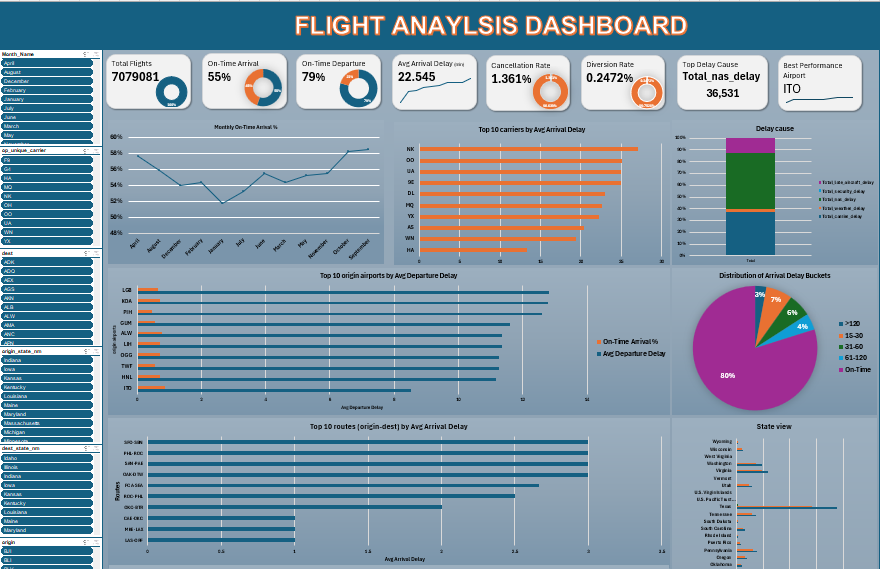

# ✈ Flight Delay Dashboard 2024 — Excel Data Analytics Project

## 📌 Project Overview
This project presents an interactive **Flight Delay Dashboard** built in Microsoft Excel to analyze domestic flight performance across the United States for the year 2024.

The dashboard transforms raw flight operational data into meaningful insights using **Power Query**, **Data Model (Power Pivot)**, **PivotTables**, and **PivotCharts**.

It allows users to monitor airline performance, delay trends, cancellations, diversions, and delay causes through interactive filters and visuals.

---

## 🎯 Project Objectives
- Analyze flight delays and on-time performance
- Identify major delay causes (Carrier, Weather, NAS, Security, Late Aircraft)
- Compare airline and airport performance
- Track cancellation and diversion patterns
- Build a professional business intelligence dashboard in Excel

---

## 📊 Dataset Information
**Dataset:** flight_data_2024.csv  https://docs.google.com/spreadsheets/d/1lXBTnTb2Onv9KuRPU4Fqvz0beThToG1o/edit?usp=sharing&ouid=111446746885125480186&rtpof=true&sd=true
**Coverage:** Domestic Flights (USA)  
**Period:** January 2024 – December 2024  
**Granularity:** One record per flight  

### Data Includes
- Flight schedule times vs actual times  
- Departure and arrival delays  
- Cancellation and diversion data  
- Delay causes  
- Flight duration and distance  

---

## 🛠 Tools & Technologies
- Microsoft Excel  
- Power Query (Data Cleaning & Transformation)  
- Power Pivot (Data Modeling)  
- PivotTables & PivotCharts  
- Excel Functions and Formulas  

---

## 📊 Dashboard Visualizations

- Monthly On-Time Arrival Trend  
- Top 10 Carriers by Average Arrival Delay  
- Top 10 Origin Airports by Departure Delay  
- Top Routes by Arrival Delay  
- Delay Cause Contribution Chart  
- Arrival Delay Distribution  
- State Performance Comparison  
- Monthly Cancellation Analysis  

---

## 📌 Learning Outcomes
This project demonstrates skills in:
- Data Cleaning and Transformation  
- Data Modeling  
- Dashboard Development  
- KPI Calculation  
- Business Data Analysis  
- Data Visualization  

